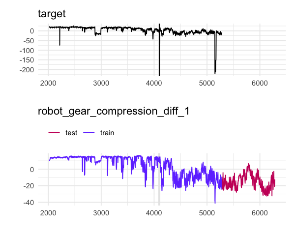

## [VC ds contest](https://vc.ru/data)

### Task
Predict numerical target variable with R^2 as metric of quality (yes, not the best metric).

### Data

3263 values for 145 features including year (so time series cross validation etc.) in train and 1000 samples in test. 

Example of the data and exploratory chart:

### Solution

1. Lots of exploratory stuff, mainly removing features which are pure noise or constant over time
2. Search of features which are correlated with peculiar peaks in target time series: not all the peaks in target can be attributed to peaks (or downs) in features
3. Selecting the existing features that matter and trying to construct new ones: after trying things like PCA and rolling mean feature transfromations, which did not bring significant improvements to the model
4. Training model is simple glmnet with time series crossvalidation
5. Folder with results containg training parameters and score in filename.
6. __Result - ~0.8969 R^2 (R^2 SD is 0.0305) on local crossvalidation and ~0.87 on test after final scoring.__

### Files breakdown

1. init.R - reading data in
2. explore.R - automatically build lots of charts, scatters, feature correlations.
3. imp_features.R - train model with all the features and get the ranking of the most important features
4. exp_features.R - experiments with OHE features (proved not very useful)
5. train_glmnet.R - train final model and save predictions to .csv